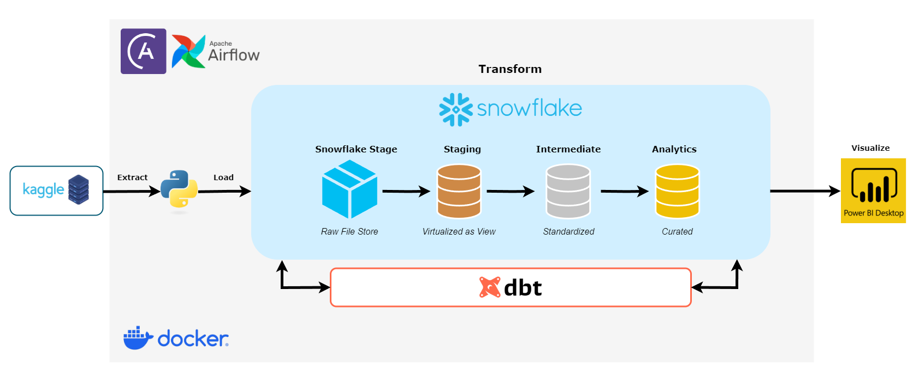

# **E-Commerce Product Performance Data Pipeline**
  
## **📌 Project Overview**
This pipeline tracks the performance of products on Shein for a company, visualizing key metrics in a **Power BI dashboard**.

The dataset consists of **21 CSV files**, each representing a different product category. These files are transformed, cleaned, and aggregated into a **single analytics layer** for reporting.

---

## **🎯 Target Audience**
- **Data Analysts** – Analyze trends, insights, and product performance.
- **Business Users** – Make data-driven decisions based on key performance metrics.

---

## **📊 Data Source**
- **Kaggle API** ([Dataset Link](https://www.kaggle.com/datasets/oleksiimartusiuk/e-commerce-data-shein))

---

## **🛠️ Technologies Used**  
| Tool                         | Purpose |
|------------------------------|---------|
| **Kaggle API**               | Extracts raw data (CSV files) from Kaggle datasets. |
| **Snowflake**                | Stores, stages, and processes data efficiently. |
| **Airflow**                  | Orchestrates workflows and schedules pipeline execution (**managed via Astronomer**). |
| **DBT**                      | Transforms and materializes data in Snowflake (**integrated via Astronomer Cosmos**). |
| **Power BI**                 | Visualizes insights, reports, and KPIs. |
| **Docker**                   | Containerizes the pipeline for consistency and portability (**provided by Astronomer**). |
| **Astronomer**               | Provides a managed Airflow environment for deployment and scalability. |


---

## **📂 Data Pipeline Flow**
### **1️⃣ Data Extraction & Loading**
- **Extract** data from **Kaggle API** using Python.
- Convert **CSV files to Parquet** format.
- Load Parquet files to **Snowflake External Stage**.

### **2️⃣ Transformation (DBT)**
- **Staging Layer (stg_products)**: Combines all **21 files** into a **single view** with their file name as the **category column**.
- **Intermediate Layer (int_products)**:
  - Cleans, normalizes, standardizes, and imputes missing values.
- **Analytics Layer**:
  - **agg_category_performance** – Category-level performance aggregation.
  - **dim_products** – Contains descriptive attributes of products.
  - **fact_product_performance** – Stores transactional performance data of each product
  - **dim_category** – Stores category metadata.

**Data Integrity Tests:**
- Tests are implemented for **int_products** and **agg_category_performance** to ensure data consistency and accuracy.

### **3️⃣ Orchestration (Airflow - Astronomer-Cosmos)**
- The pipeline **runs daily** but can be reconfigured.
- **Email notifications** are sent upon **successful execution**.

---

## **📊 KPIs & Dashboard Design**
### **Key Metrics:**
✔️ **Revenue**  
✔️ **Total Products**  
✔️ **Units Sold**  
✔️ **Average Order Value (AOV)**  
✔️ **Average Price per Category**  
✔️ **Average Discount per Category**  
✔️ **Ranked Items per Category**  

### **Visuals in Power BI:**
📊 **Scorecard** – Displays key metrics.  
📊 **Matrix/Table** – Detailed breakdown by category.  
📊 **Bar Chart** – Visualizes trends over time.  
📊 **Slicer/Filters** – Allows users to drill down into categories.  

---

## **📌 Setup & Installation**
### **1️⃣ Prerequisites**
Ensure you have the following installed:
- **Docker** (Required for running Airflow & DBT)
- **Python 3.10+**
- **Snowflake Account** (Can use a free trial)
- **Power BI** (For visualization)

### **2️⃣ Environment Variables**
Set up your **`.env` file** with the following:

```plaintext
# Snowflake Credentials
SNOWFLAKE_USER=your_snowflake_username
SNOWFLAKE_PASSWORD=your_snowflake_password
SNOWFLAKE_ACCOUNT=your_snowflake_account
SNOWFLAKE_WAREHOUSE=your_snowflake_warehouse
SNOWFLAKE_DATABASE=your_snowflake_database
SNOWFLAKE_SCHEMA=your_snowflake_schema
SNOWFLAKE_ROLE=your_snowflake_role

# Airflow Email Notifications
AIRFLOW__SMTP__SMTP_HOST=smtp.gmail.com
AIRFLOW__SMTP__SMTP_PORT=587
AIRFLOW__SMTP__SMTP_USER=sender_email@example.com
AIRFLOW__SMTP__SMTP_PASSWORD=sender_password
AIRFLOW__SMTP__SMTP_MAIL_FROM=sender_email@example.com
AIRFLOW__SMTP__SMTP_STARTTLS=True
EMAIL_RECIPIENT=receiver_email@example.com

# Other
PROTOCOL_BUFFERS_PYTHON_IMPLEMENTATION=python

## **3️⃣ Additional Credentials**
- Store Kaggle credentials in `include/.kaggle`.
- Install Power BI for visualization.

---

## **📌 Running the Pipeline**

### **1. Ensure All Credentials are Set**
- Make sure you have Kaggle and Snowflake credentials.
- Store them in the environment variables.

### **2. Start Astro Dev**
```bash
astro dev start
```

### **3. Handling Postgres Port Conflict**
This pipeline uses the PostgreSQL port (5432). If you encounter an error indicating the port is in use, run:
```bash
netstat -ano | findstr :5432
taskkill /PID <PID> /F
```
Then restart Astro Dev:
```bash
astro dev stop
astro dev start
```

---

## **🚀 Future Enhancements**
- Integrate **Soda Test** (Pending compatibility fixes between Soda Core and Astronomer Cosmos).
  - `soda-core` relies on an older version of OpenTelemetry, while **Astronomer Cosmos** requires a newer version, leading to dependency conflicts.
- Expand the dataset for deeper analytics.
